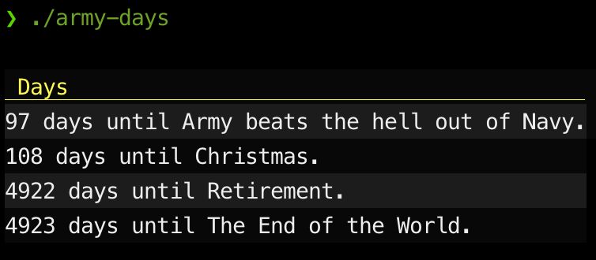

+++
title = 'army-days in Go'
date = 2024-09-08T16:25:18-05:00
draft = false
summary = 'Rewriting my countdown days program in Go (again)'
tags = ['go', 'golang', 'claude', 'ai', 'tdd', 'army-days']
+++
# Rewriting my `army-days` cli utility in go

## Overview

I've written essentially this same program in multiple languages, multiple times. It's not quite a code kata for me, but it is something I've used for various tests.

Use case: you want to do know how many days until ... some event/date in the future. You like staying in the terminal. Side case: you're a plebe at West Point and need to know "the days" in case you're asked.

### Link to project

[Link to the latest Go version of this project](https://github.com/swilcox/army-days).

### Prior Work and Goals

So my [most complete prior implementation](https://github.com/swilcox/v-army-days) is actually written in [V](https://vlang.io). A discussion on V, I'll save for another day. But in effort to boost my Go skills, I decided to re-tackle this same program in Go (again) but try to achieve feature parity in terms of colorized output and some tests.

## Claude Usage

To get started, I decided to have [Claude](https://claude.ai) (sonnet) attempt the problem. The latest setup with Claude on the web is pretty slick where I was able to first upload my initial json configuration file from my working V version of the program and explain the problem. And essentially that first version of the Claude program worked. It was not without flaws, but it read in the configuration file, and computed the number of days until the events. I also had it break the program up into multiple files and to add some tests, make the date format more flexible (supporting both RFC3339 datetime stamps as well as just plain old `2024-09-08` style dates). Initially, when I instructed Claude to support command parameters and to do colorized output, it picked different libraries than I would have chosen. Impressively, I was able to instruct it to switch to [akamensky/argparse](https://github.com/akamensky/argparse) and [gookit/color](https://github.com/gookit/color) and it immediately rerendered the files and provided links to the newly updated source files. I also requested that YAML be the new default input file type but that the program should handle both.

As I've noticed in the past, this is pretty good way to get a start on a project, but it eventually feels laborious to keep iterating within the LLM. So it was at this point that I left Claude behind and forged ahead. So issues encountered and/or changes:

* I preferred to put most of the source files in a subdirectory, leaving only the `main.go` file in root of the project. Claude had happily split things up but assumed that everything was going to be part of the `main` package.
* Claude seemed unaware that there was a newer YAML library for Go. It specified `gopkg.in/yaml.v2 v2.4.0` in its version of the `go.mod` file. Meanwhile, v3 has been available, near as I can tell since 2022. And more importantly, it's compliant with [YAML 1.2](https://yaml.org/spec/1.2.2/) which is considered a superset of JSON. So that means, that the extra things Claude had tried to do around detecting which filetype it was dealing with and having different code paths for JSON vs YAML were unnecessary. I'm sure there may be some situations where you still might want separate handling, but I couldn't think of a good reason so I opted to simplify by treating everything as YAML which *should* then handle JSON files as well.
* I did go back and ask for a few more things as I began working on my version in order to get ideas on how to approach things. For example, Claude's first suggestion for handling "default" configuration (so that config values in the input file could be omitted) was rather bizarre with a function that would be called with a pointer to the values and if it was `nil`, would then return `false`. It definitely would work, but it felt so wrong. What if I added a `string` configuration option or something else? It would be completely broken. So when I asked Claude for a different suggestion for handling defaults I said this:

> Can we change the Config struct to handle defaults rather than the getBoolValue function?

* Claude then happily gave a different mechanism that felt much more like what I expected. And it was the kind of thing that would have taken me quite some time to figure out on my own. But of course, this points to the fact that I *knew* that the first suggestion wasn't good.
* I also split out output in a separate way and made everything closer to simpler (but not really pure) functions.
* For tests, I did start with what was suggested but then because I had split out the output to a separate file, I was able to test things more independently and I added some dependency injection for testing output. Verifying how to do that was also a Claude prompt, though I did it in a separate context.
* Same for version return information. I've not yet decided on version tagging, compile time injection and switching to a `Makefile` for this project, but I did set things up in preparation to eventually be able to do that if I want to.
* Finally, I added a basic github action but based it primarily on some of my own prior work.

## Conclusion

I'm pretty happy with what I ended up with. It was a day of hacking around. I learned some stuff. Claude got me started much faster than I would have otherwise. But, my experience and intuition were invaluable in getting me to a better result. Also, I get tired of trying to explain myself for stuff where I know what's likely to happen. I want to quickly get to that "I'll take it from here" point. Using in-editor AI assistance then makes much more sense. I've still not come to a conclusion about which VSCode plugin I like best for that.

Other conclusion: I still like V's readability better. I may go back and make an updated shot of the V version of this program.

### Follow-up Items

* I need to redo how date parsing is done. I feel like it should be a custom `Unmarshal` bit more like configuration defaults are instead of the hacked function that I did keep (and modify) from Claude.
* There's some error handling that's not done correctly that I ought to fix.
* Injecting the git tag `version` possibly by switching to `make` with parameters for the `build` as [folks tend to recommend](https://www.reddit.com/r/golang/comments/131kjwg/using_ldflags_to_set_version_information/).