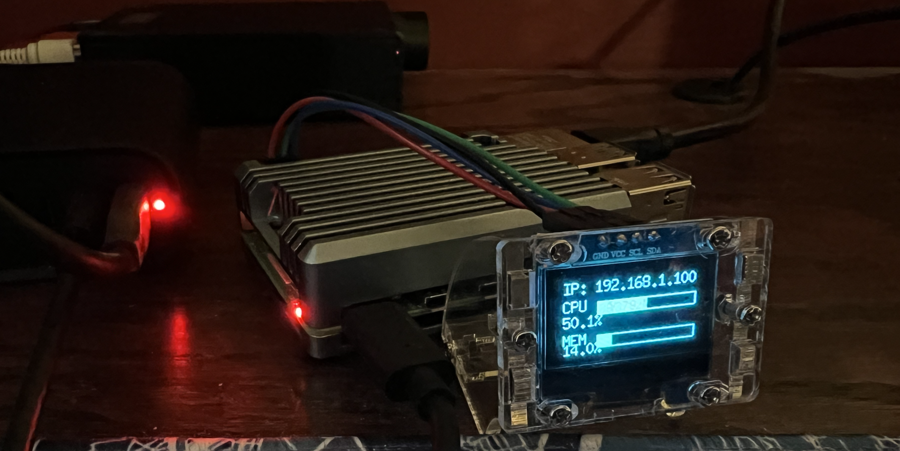

+++
title = 'More Coding with Claude'
date = 2025-02-11T08:18:20-06:00
summary = 'Using Claude to write a Go program for displaying information on a tiny OLED display attached to a Raspberry Pi'
draft = false
tags = ['ai', 'raspberrypi', 'go']
+++
# More Coding with Claude

## Overview

Quite some time ago, I bought a package of [tiny single color OLED displays](https://www.amazon.com/dp/B0BFD4X6YV). They cost roughly $3 each. When you run headless Raspberry Pis, it's nice to have some information about whey they're doing, particularly, what IP address they've been assigned but also CPU and memory usage.

When I originally bought the displays, I got one working with Python using an Adafruit library that I downloaded from somewhere and I cobbled together some very adhoc code that eventually worked. Nothing I did was repeatable or deployable in any sort of way. But I recently bought a clear plastic housing for the display (on ebay and ironically the case costs significantly more than the display itself) and decided to take another stab at making it all work in a more repeatable way.

## Claude to the Rescue

At first I thought I'd just search the internet for a Go library that can be used to drive the display, but I was getting pointed in multiple directions, and on top of that, I'm far less proficient in Go than Python, so I decided to try Claude again for this project.

Within 30 minutes of interacting with Claude, I had a working project. It wasn't just a single prompt. This was a conversation, but after reading [this quote from Andrej Karpathy](https://x.com/karpathy/status/1886192184808149383?prefetchTimestamp=1739284686723&mx=2) I really tried to go with the whole "vibe" thing. Just let the AI run with it.

> There's a new kind of coding I call "vibe coding", where you fully give in to the vibes, embrace exponentials, and forget that the code even exists. It's possible because the LLMs (e.g. Cursor Composer w Sonnet) are getting too good. Also I just talk to Composer with SuperWhisper so I barely even touch the keyboard. I ask for the dumbest things like "decrease the padding on the sidebar by half" because I'm too lazy to find it. I "Accept All" always, I don't read the diffs anymore. When I get error messages I just copy paste them in with no comment, usually that fixes it. The code grows beyond my usual comprehension, I'd have to really read through it for a while. Sometimes the LLMs can't fix a bug so I just work around it or ask for random changes until it goes away. It's not too bad for throwaway weekend projects, but still quite amusing. I'm building a project or webapp, but it's not really coding - I just see stuff, say stuff, run stuff, and copy paste stuff, and it mostly works.
> -- <i>Andrej Karpathy</i>

## Results

So I started with this prompt:

>SW
> I want to drive an oled ssd1306 display connected to my raspberry pi using a go program. Help get a basic golang program running that can do this.

Copying from the result and artifacts into a basic editor and running and providing error messages back, I eventually ended up with a working program.

Repository is [here](https://github.com/swilcox/go-monitor-ssd1306).

Going from nothing to working project for something that's a bit more unusual and more physically visible was amazing especially in a very short period of time. Writing this blog post took significantly more time.
